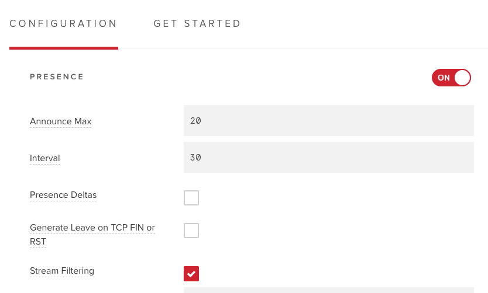
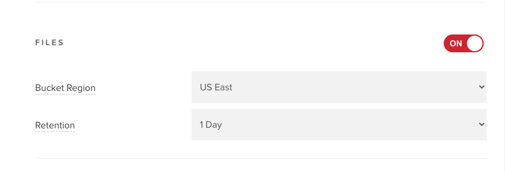

## How to design a "moderate-able" chat app

PubNub provides a flexible set of APIs for creating real time messaging applications. The Moderation
Dashboard application makes some assumptions about how a chat application is designed. This section
provides an overview for how to build a chat application that will work well with the moderation
dashboard.

The moderated-chat sample in the
[PubNub Chat UI Components](https://www.pubnub.com/docs/chat/components/overview) project provides a
reference for implementing the techniques described here, and is a reccomended starting point for
developers building a new chat application.

1. Users

   The user view in the moderation tool is populated via user metadata. Therefore any chat app
   should include logic that sets up each UUID with user object data that includes at least the
   field `name`. `email` and `profileUrl` can also be added by the admin in users object metadata
   which are optional fields

   Here is an example of a fully populated user object that can be interpreted by the dashboard.

   ```bash
   custom: { "name": "John Smith", "email": "jsmith@acme.com", "profileUrl": "https//profiles.acme.com/johnsmith"}
   ```

   Object metadata is not enabled by default. Before making calls to the PubNub Objects API, you
   must enabled Objects for your keyset via the Admin Portal as described in the
   [User Metadata documentation](https://www.pubnub.com/docs/connections/users-metadata). In order
   for your chat clients to be notified of changes to the user's status, you must also enable "User
   Metadata Events" and "Channel Metadata Events" in the Admin Portal.

   

   For simplicity this application sets user metadata to ban, mute, block or flag users. Chat
   application developers may also choose to use the PubNub Access Manager to implement muting or
   blocking a channel. This readme describes how a developer can inspect user object metadata in a
   chat app to enforce banning, muting, or blocking a user. If you wish to use PAM, you will need to
   modify this app to update your user’s PAM tokens accordingly. This technique is also described
   below.

   - Ban User: A banned user should not have any access to any channel in a chat application. Chat
     applications that enforce banned users via metadata should inspect a user’s metadata after they
     “log in” to the chat app. If the metadata includes a `“ban: true”` field, the application
     should log the user out, or otherwise prevent them from viewing or sending messages to any
     channels. Developers whose chat apps use PAM may wish to update the code in BanUser.js,
     replacing (or adding to) the call to setUserMetaData, with a call to the backend service that
     manages the PAM tokens, ie: https:/mypamservice.acme.com/blockUser?uuid=UUID. This interface
     should implement a pubnub.grant() call that sets the user's read and write permissions to false
     for all channels.

   - Mute User: A muted user should be allowed to see the messages in a channel, but should not be
     allowed to publish them. To enforce a muted user on a particular channel using the user’s
     metadata, inspect the `mutedChannels` property of the user’s metadata. If the comma separated
     list in the value includes the current channel, the application should provide some type of GUI
     that informs the user they are muted on the channel and does not allow them to publish to that
     channel. Developers whose chat apps use PAM may wish to update the code in UserAction.js,
     replacing (or adding to) the call to handleMuteClick, with a call to the backend service that
     manages the PAM tokens, ie: https:/mypamservice.acme.com/muteUser?uuid=UUID&channel=CHANNELID.
     This interface should implement a pubnub.grant() call that sets the user's write permissions to
     false for the channel

   - Block User: A blocked users should not be allowed to see messages or create new messages to any
     channels that they are blocked from. To enforce a blocked user on a particular channel using
     the user’s metadata, inspect the `blockedChannels` property of the user’s metadata. If the
     comma separated list in the value includes the current channel, the application should provide
     some type of GUI that informs the user they are blocked from the channel and does not allow
     them to subscribe or publish to that channel. Developers whose chat apps use PAM may wish to
     update the code in UserAction.js, replacing (or adding to) the call to handleMuteClick, with a
     call to the backend service that manages the PAM tokens, ie:
     https:/mypamservice.acme.com/blockUser?uuid=UUID&channel=CHANNELID. This interface should
     implement a pubnub.grant() call that sets the user's read and write permissions to false for
     the channel

   - Flag User: Moderated chat apps may wish to implement the ability for one user to flag another
     user. Apps that implement this functionality should update the flagged user's metadata with the
     following key/values:

     ```json
     flag: true,
     flaggedAt: "2021-09-10T07:40:15.538Z", // ISO timestamp when flagging occured
     flaggedBy: "uuid - userName", // flagging user's uuid and name
     reason: "reason for flagged"  // optional reason collected in flagging UI
     ```

2. Channels

   The channel view in the moderation tool is populated via channel metadata. Therefore any chat app
   should include logic that sets up each channel with channel object data that includes fields:
   channel and name. description can also be added by the admin in channels object metadata which is
   a optional field.

   Here is an example of a fully populated channel object that can be interpreted by the dashboard.

   ```json
   custom: {
     "id": "space_bc03548bcb11eb8dcd0242c130",
     "name": "Besties",
     "description": "",
     "updated": "2021-08-05T07:05:30.480949Z"
   }
   ```

   Note: It is a best practice/encouraged that moderated channels follow a channel ID naming pattern
   such as “public.\*“

3. Channel Memberships

   The dashboard's ability to show which users are online/offline in the channel view is powered by
   [PubNub Presence](https://www.pubnub.com/docs/presence/overview). Presence is not enabled by
   default. In order for this to work in the dashboard for your chat app, you must also enable
   "Presence" in the Admin Portal. Once enabled you can accept the default settings.

   

4. Messages

   The Moderation Dashboard provides a view that allows Admins to review messages sent over the last
   24 hours, and optionally to delete or modify those messages. This functionality requires that
   PubNub's [Storage and Playback](https://www.pubnub.com/docs/chat/features/message-history)
   capability is enabled for the moderated chat application's keyset in the Admin Console. Storage
   is not enabled by default. After enabling storage set a retention value of 1 day (or more if your
   application will use stored messages in a different way).

   

   When an Admin modifies a message, a message action is added to a message with the new updated
   value as below:

   ```javascript
      action: {
         type: 'updated',
         value: 'Hello World! (fixed typo)',
      },
   ```

   When an Admin deletes a message, a message action is added to a message with type deleted action
   as below:

   ```javascript
      action: {
         type: 'deleted',
         value: '.',
      },
   ```

   To design a chat app that responds to these Admin actions, one needs to ensure that the chat app
   [listens for messageAction events](https://www.pubnub.com/docs/messages/actions), and updates the
   message history view appropriately. Similarly, when a chat app fetches messages from
   [PubNub Storage](https://www.pubnub.com/docs/messages/storage#retrieving-messages) via the
   History API, it should ensure that any messageAction data returned is processed appropriately.

5. Automatic Moderation

   The Moderation Dashboard deploys
   [PubNub Functions](https://www.pubnub.com/docs/functions/overview) to perform automatic Text and
   Image moderation. These functions are invoked when a `Before Publish or Fire` (for text
   moderation) or a `Before Publish File` (for image moderation) event occurs. The logic in these
   functions expects the publish payloads to be in below format for text and image moderation.

   ```json
   {
     "text": "Message with text"
   }
   ```

   Following are the formats for messages which are send through text and image moderation
   functions:

   - Text message:

   ```json
   {
     "message": {
       "text": "hello",
       "type": "text"
     },
     "timetoken": "16288547735385049",
     "message_type": null,
     "meta": "",
     "uuid": "userId"
   }
   ```

   - Image+text message:

   ```json
   {
     "message": {
       "message": {
         "text": "hi",
         "type": "text"
       },
       "file": {
         "url": "fileUrl",
         "name": "Screenshot.png",
         "id": "bdc547d5-1444-4763-b081-407e067f781e"
       }
     },
     "timetoken": "16288575775551984",
     "message_type": 4,
     "meta": "",
     "uuid": "userId"
   }
   ```

   The Text Moderation configuration allows for the moderation logic to block a message completely
   (in which case no subscribe event is sent to the clients), or to mask the message. The following
   is an example of the message format that will be used when the text moderation logic transforms a
   masked message:

   - Moderated text message:

     ```json
     {
       "message": {
         "text": "***",
         "type": "text"
       },
       "timetoken": "16288559005032306",
       "message_type": null,
       "meta": "",
       "uuid": "user1"
     }
     ```

   The Text and Image Moderation configuration allows for the moderation logic to route a copy of
   any masked or blocked message to be routed to a banned channel. For example if a message is
   posted to a channel called `public.water-cooler`, the banned message will be sent to a channel
   called `banned.public.water-cooler`.

   Chat clients should not display the contents of `banned.*` channels to end users as they are for
   the use of Moderation Admins only.

   The following are examples of moderated messages sent to a banned channel:

   - Masked/routed text message to banned channel:

   ```json
   {
     "message": {
       "moderatedMessage": "***",
       "type": "text",
       "originalMessage": "go to hell"
     },
     "timetoken": "16288559005165712",
     "message_type": null,
     "meta": "",
     "uuid": ""
   }
   ```

   - Banned/blocked image + masked text message to a banned channel:

   ```json
   {
     "message": {
       "message": {
         "moderatedMessage": "***",
         "type": "text",
         "originalMessage": "go to hell",
         "reason": "personal attack"
       },
       "type": "text",
       "file": {
         "url": "fileUrl",
         "reason": [
           {
             "text": "reason for blocking"
           }
         ],
         "type": "image",
         "id": "fileId",
         "name": "image.png"
       }
     },
     "timetoken": "16288568309185250",
     "message_type": null,
     "meta": "",
     "uuid": ""
   }
   ```

6. Files

   Developers who wish to leverage the Dashboard's Image Moderation feature will need a chat
   application that [uses PubNub to send Files](https://www.pubnub.com/docs/messages/files). File
   sending is not enabled by default, and must be enabled in the Admin console for your keyset.

   

   Sending Files via PubNub requires a paid account.
